# Manual del fotógrafo

Cómo se hace, paso a paso, cada gestión de la aplicación que está al alcance de un fotógrafo: ver el catálogo, su cuenta y sus datos, y el mantenimiento de sus portfolios, colecciones y fotos. Para fotógrafos.

Corresponde a la versión 2.3.0 de la aplicación, a 7 de octubre de 2026. Las capturas de pantalla están hechas con datos inventados.

## Quién puede hacer qué

| Usuario | Quién es | Qué puede hacer |
|---|---|---|
| **Visitante** | Cualquiera que entra sin iniciar sesión. | Ver el catálogo (lo que no esté oculto), cambiar el tema, registrarse e iniciar sesión. |
| **Fotógrafo** | Quien se ha registrado y ha iniciado sesión. | Lo mismo que el visitante y, además, mantener lo suyo: sus datos, su foto de perfil, sus portfolios, sus colecciones y sus fotos. Ve también lo que él mismo ha ocultado. |

Los botones de mantenimiento ("Editar", "Eliminar", "Gestionar portfolios", "+ Nuevo portfolio", etc.) solo aparecen a quien puede usarlos. Si alguien escribe a mano la dirección de una página de mantenimiento sin tener permiso, la aplicación le devuelve a la portada.

## La pantalla

En la franja superior de todas las páginas están:

- A la izquierda, "Portfolios fotográficos.", que lleva siempre a la portada.
- A la derecha, el selector de tema ("Oscuro" / "Claro") y, según haya sesión o no, "Iniciar sesión" o el menú del usuario (su foto o sus iniciales, su nombre y una flecha).

En las páginas de un fotógrafo, de sus portfolios y de sus colecciones aparece además, bajo la franja, la firma del fotógrafo (su logo); pulsarla lleva a su página.

Cada nombre (de fotógrafo, de portfolio o de colección) forma parte de la dirección de su página, escrito en minúsculas, sin tildes y con guiones en lugar de espacios: "Montaña" se convierte en `montanya` y "Proyectos personales" en `proyectos-personales`. Si se escribe una dirección con mayúsculas, tildes o espacios, la aplicación la corrige sola.

## Ver el catálogo

### Cómo recorrer fotógrafos, portfolios y colecciones

1. Entra en la portada. Verás el título "Fotógrafos" y una tarjeta por fotógrafo, con su nombre, su descripción y cuántos portfolios y colecciones tiene. Si has iniciado sesión como fotógrafo, tu tarjeta está resaltada y lleva la marca "Tú".
2. Pulsa la tarjeta de un fotógrafo. Su página ("Portfolios de …") muestra una tarjeta por portfolio, con su portada, su nombre, su descripción y su número de colecciones. Si el portfolio aún no tiene fotos, en lugar de la portada pone "Sin fotos" o "Sin colecciones".
3. Pulsa un portfolio. Su página ("Portfolio: …") muestra sus colecciones, cada una con su portada (o "Sin fotos") y su nombre.
4. Pulsa una colección. Su página ("Colección: "…"") muestra todas sus fotos en una cuadrícula.
5. Para volver atrás usa los enlaces de la parte superior: "← Fotógrafos" (solo si llegaste desde la portada), "← Portfolios" o "← (nombre del portfolio)".

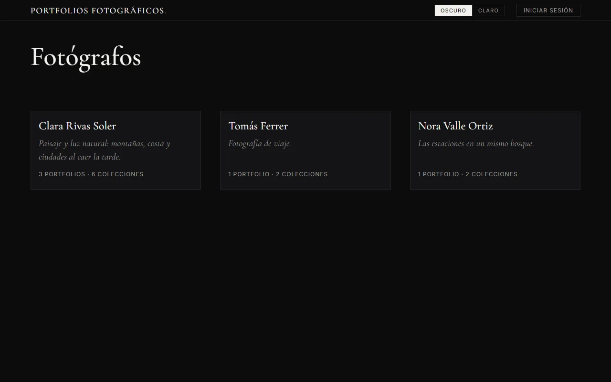

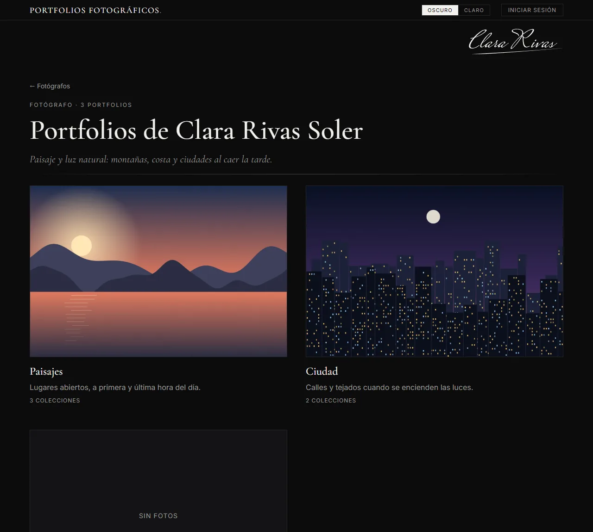

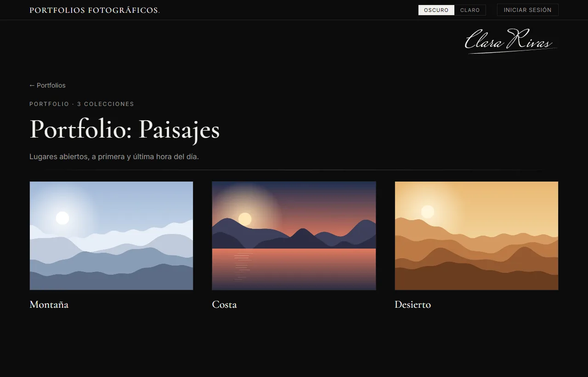

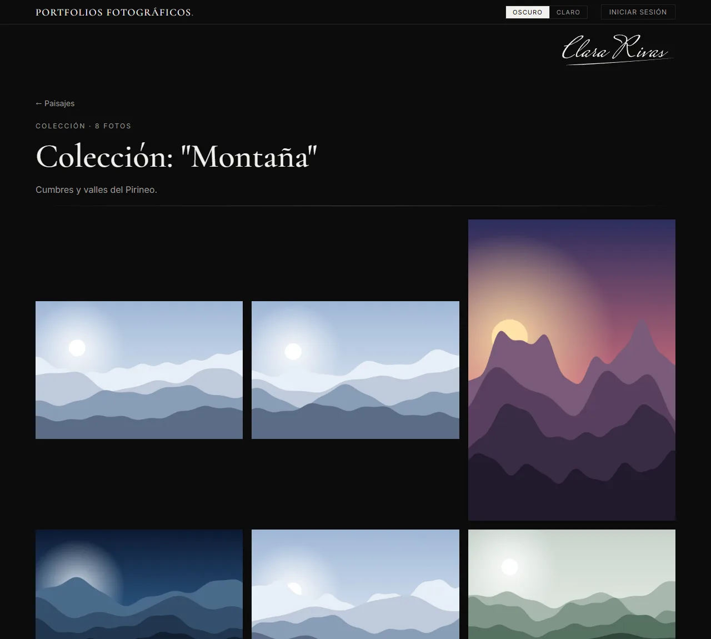

Si una dirección no corresponde a nada (o a algo que está oculto para ti), verás "Fotógrafo no encontrado", "Portfolio no encontrado" o "Colección no encontrada", con un enlace para volver.

### Cómo ver las fotos a pantalla completa

1. En la página de una colección, pulsa cualquier foto. Se abre el visor con la foto en grande y, si la tiene, su título debajo.
2. Pasa a la foto siguiente o a la anterior con las flechas laterales "›" y "‹" o con las teclas flecha derecha y flecha izquierda. Al llegar a la última se vuelve a la primera, y al revés.
3. Cierra el visor con "×", con la tecla Escape o pulsando fuera de la foto.

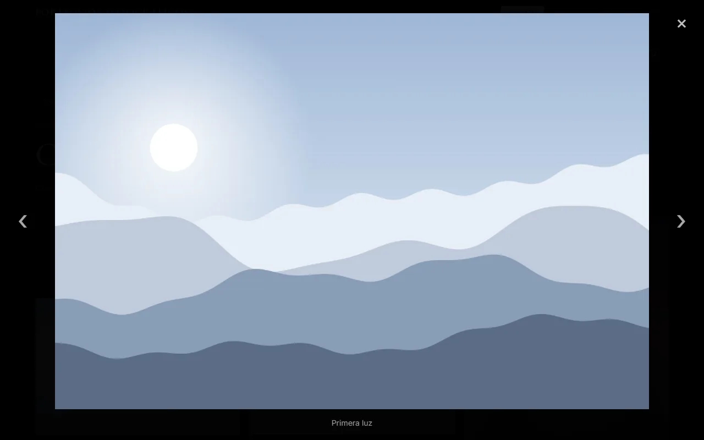

### Cómo cambiar entre el tema oscuro y el claro

1. En la franja superior, pulsa "Oscuro" o "Claro".
2. La página cambia en el momento. El navegador recuerda la elección para las siguientes visitas.

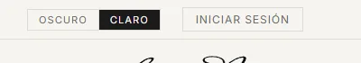

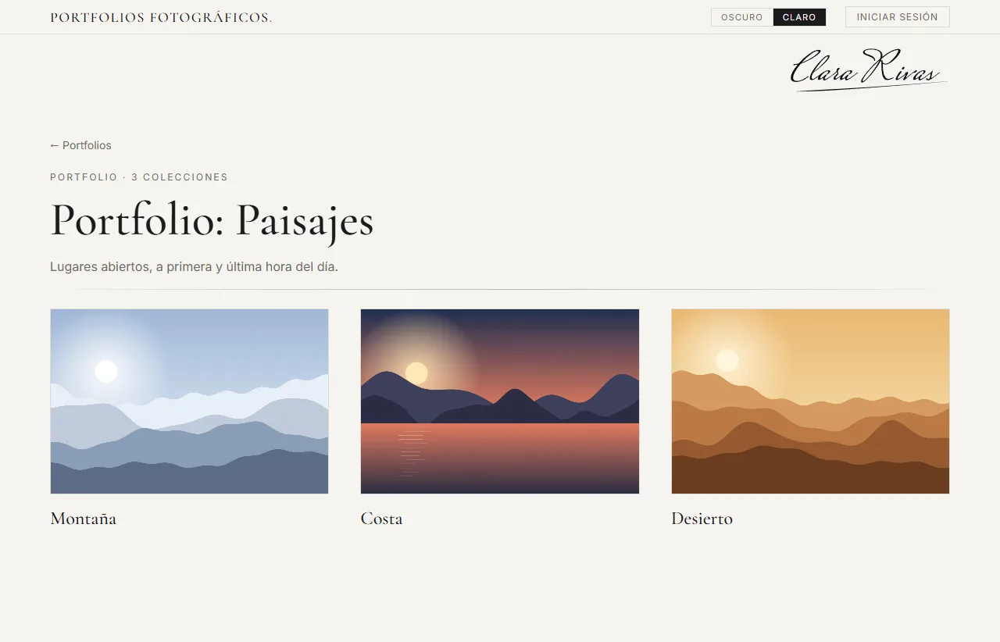

Si has iniciado sesión y tienes un tema preferido en "Configuración", ese tema se aplica cada vez que inicias sesión, aunque antes hubieras elegido el otro en la franja superior.

## Cuenta y sesión

### Cómo registrarse como fotógrafo

1. Pulsa "Iniciar sesión" en la franja superior y, en el diálogo, "¿No tienes cuenta? Regístrate".
2. Se abre "Crear cuenta". Los campos obligatorios llevan un asterisco.
3. En "Datos de acceso", escribe tu "Usuario": de 3 a 30 caracteres, con letras sin tildes, números, ".", "_" o "-". Con él (o con tu correo) iniciarás sesión.
4. En "Datos de fotógrafo", si quieres, añade tu "Foto de perfil" (ver "Cómo poner o cambiar la foto de perfil").
5. Rellena "Nombre informal" (cómo se te conoce, p. ej. "Ana Ruiz": es el texto de tu firma y de tu dirección en la web), "Nombre" y "Primer apellido". "Segundo apellido" y "Descripción" son opcionales.
6. Escribe tu "Correo electrónico" y una "Contraseña" de al menos 8 caracteres, y repítela en "Repetir contraseña".
7. Pulsa "Crear cuenta". Si todo es correcto, la sesión queda iniciada y la aplicación te lleva a tu página de fotógrafo.

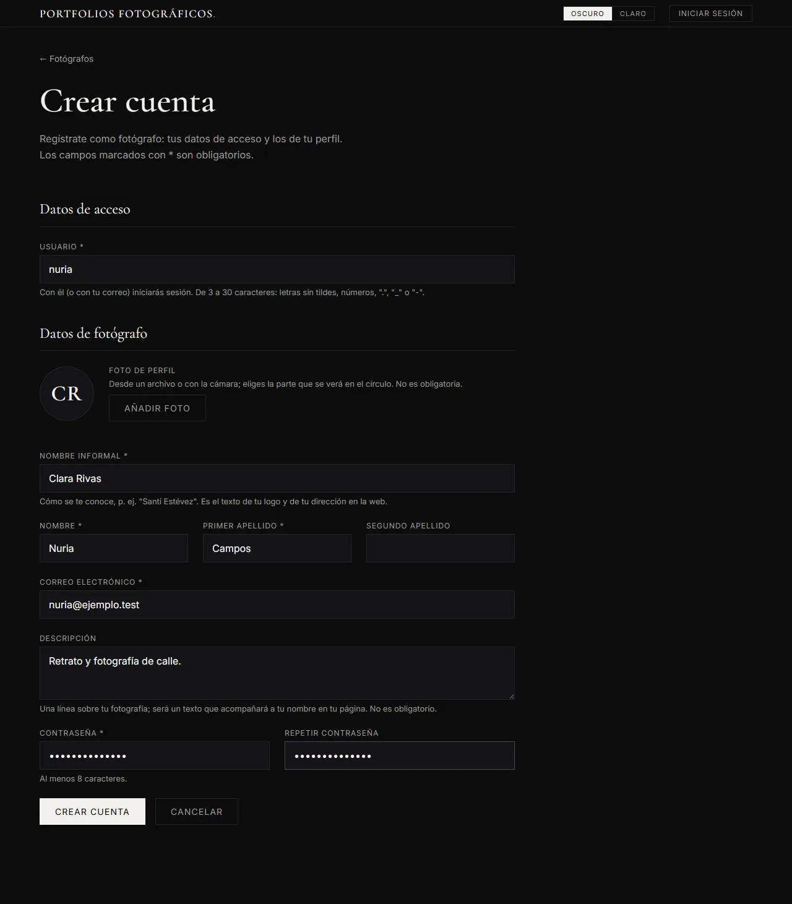

El registro se rechaza, con el aviso "No se ha podido crear la cuenta", si el usuario o el correo ya los usa otra persona, si el correo no tiene un formato válido, si la contraseña es demasiado corta, o si el nombre informal coincide con el de otro fotógrafo o con una dirección reservada de la aplicación (`admin`, `api`, `configuracion`, `gestion`, `perfil`, `photos` o `registro`).

### Cómo iniciar sesión

1. Pulsa "Iniciar sesión" en la franja superior.
2. Escribe tu "Usuario o correo" y tu "Contraseña".
3. Pulsa "Entrar". El diálogo se cierra y, en la franja superior, aparece tu nombre en lugar de "Iniciar sesión".

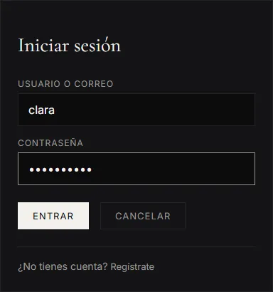

Si el usuario o la contraseña no son correctos, el diálogo muestra "El usuario o la contraseña no son correctos." (el mismo mensaje en todos los casos, para no revelar cuál falla). "Cancelar" cierra el diálogo sin iniciar sesión.

La sesión dura 30 días en ese navegador, salvo que la cierres antes.

### Cómo cerrar sesión

1. Pulsa tu nombre en la franja superior para abrir el menú del usuario.
2. Pulsa "Salir". La sesión se cierra y la aplicación vuelve a la portada.

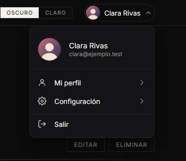

El menú del usuario se cierra sin hacer nada pulsando fuera de él o con la tecla Escape.

### Cómo consultar "Mi perfil"

1. Pulsa tu nombre en la franja superior y elige "Mi perfil".
2. En "Cuenta" verás tu usuario, tu correo, tu rol, si tienes contraseña, tu tema preferido, la fecha de alta y la del último acceso.
3. En "Fotógrafo" verás tu nombre informal, tu nombre completo, tu descripción, cuántos portfolios y colecciones tienes, y tu firma.
4. Desde aquí puedes ir a "Configuración", a "Ver mi página" o a "Editar mis datos y foto".

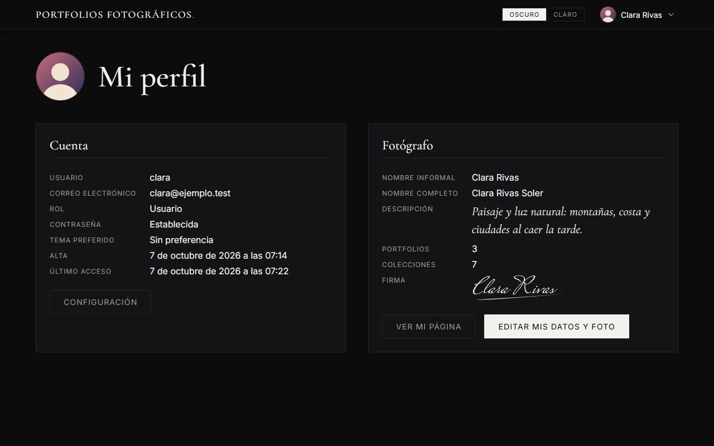

### Cómo elegir el tema preferido

1. Pulsa tu nombre en la franja superior y elige "Configuración".
2. En "Tema por defecto", elige "Oscuro" (fondo oscuro y neutro, para que las fotos destaquen) o "Claro" (papel cálido y tinta casi negra).
3. Pulsa "Guardar". Aparece "Configuración guardada. Se aplicará cada vez que inicies sesión." y el tema se aplica en el momento.

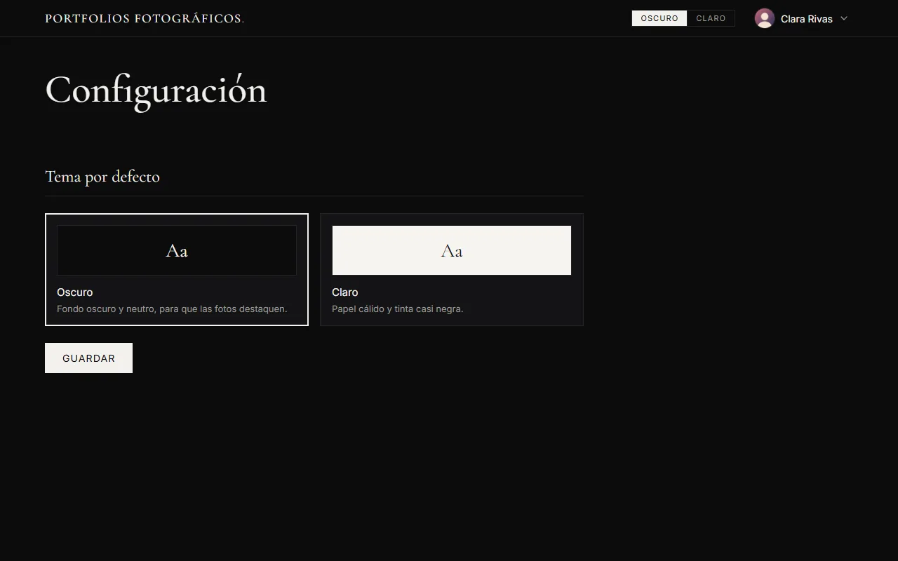

El tema preferido se guarda en tu cuenta, así que se aplica al iniciar sesión en cualquier navegador.

### Cómo poner o cambiar la foto de perfil

La foto de perfil aparece en el menú del usuario, en "Mi perfil" y en el formulario de tus datos. Si no tienes, se muestran tus iniciales.

1. Ve a "Mi perfil" y pulsa "Editar mis datos y foto" (o, al registrarte, usa la sección "Foto de perfil" del formulario).
2. Pulsa "Añadir foto" (o "Cambiar foto" si ya tienes una). Se abre el diálogo "Foto de perfil".
3. Elige el origen. Con "Elegir un archivo", selecciona una imagen de tu equipo. Con "Usar la cámara", espera a que desaparezca "Preparando la cámara…", colócate (la imagen se ve como en un espejo) y pulsa "Capturar"; "Volver" regresa a la elección del origen.
4. Encuadra la foto: el círculo marca la parte que se verá. Arrastra la imagen para moverla (o usa las teclas de flecha) y amplíala con el deslizador, con la rueda del ratón o con las teclas "+" y "-" (hasta cuatro veces). La imagen siempre cubre el círculo entero.
5. Pulsa "Aceptar". "Elegir otra" vuelve a la elección del origen y "Cancelar" cierra el diálogo sin cambiar nada.

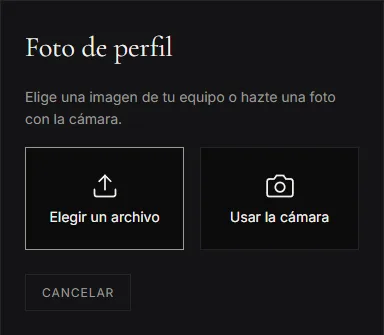

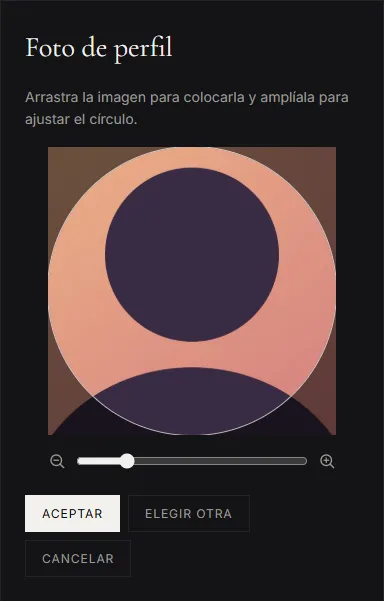

Al editar tus datos, la foto se guarda en el momento (verás "Guardando…"); en el registro se guarda al pulsar "Crear cuenta". Para quitarla, pulsa "Quitar".

Posibles avisos: "El archivo elegido no es una imagen.", "No se ha podido abrir la imagen.", "Este navegador no permite usar la cámara aquí (hace falta una conexión segura: https o localhost)." y "No se ha podido usar la cámara: comprueba que hay una, que no la está usando otra aplicación y que has dado permiso."

## Datos del fotógrafo

### Cómo editar tus datos

1. Abre el formulario con "Editar mis datos y foto" en "Mi perfil", con "Editar" en la cabecera de tu página de fotógrafo o con "Editar" en tu tarjeta de la portada.
2. En "Editar fotógrafo", cambia lo que quieras: foto de perfil, nombre informal, nombre, apellidos, correo, descripción o contraseña.
3. Para cambiar la contraseña, escribe la nueva (al menos 8 caracteres) y repítela. Si dejas el campo vacío, se mantiene la actual.
4. Pulsa "Guardar cambios". La aplicación vuelve a tu página de fotógrafo. "Cancelar" vuelve sin guardar.

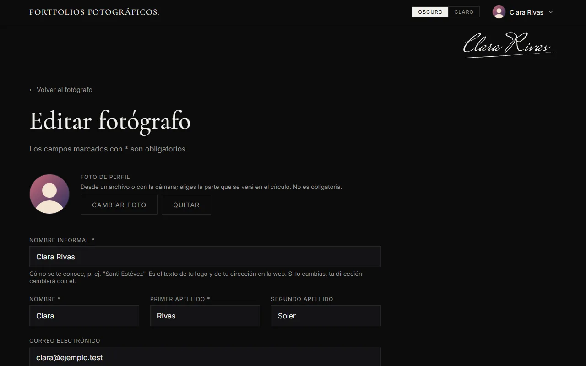

Si cambias el nombre informal, cambian también la dirección de tu página y tu firma. Si algo se rechaza, verás el aviso "No se han podido guardar los cambios" con lo que se intentaba y el motivo (por ejemplo, que ya existe otro fotógrafo con ese nombre informal o que el correo ya lo usa otro usuario).

### Cómo eliminar tu cuenta de fotógrafo

Se eliminan tus datos de fotógrafo y tu cuenta de usuario, de modo que ya no podrás iniciar sesión con ella.

1. Pulsa "Eliminar" en la cabecera de tu página o en tu tarjeta de la portada.
2. Si no tienes portfolios, se elimina sin más.
3. Si tienes portfolios, aparece el diálogo "Eliminar fotógrafo" con el mensaje "El usuario que intenta eliminar tiene portfolios creados. Si lo elimina, se perderán de forma permanente sus portfolios, colecciones y fotos. ¿Desea continuar?". Pulsa "Sí, eliminar" para eliminarlo todo o "Cancelar" para dejarlo como estaba.

La eliminación no se puede deshacer.

## Portfolios

Estas tareas solo se pueden hacer con los portfolios propios. Con la sesión iniciada, tu página de fotógrafo muestra "Editar" y "Eliminar" en la cabecera y en cada portfolio, y los botones "Gestionar portfolios" y "+ Nuevo portfolio".

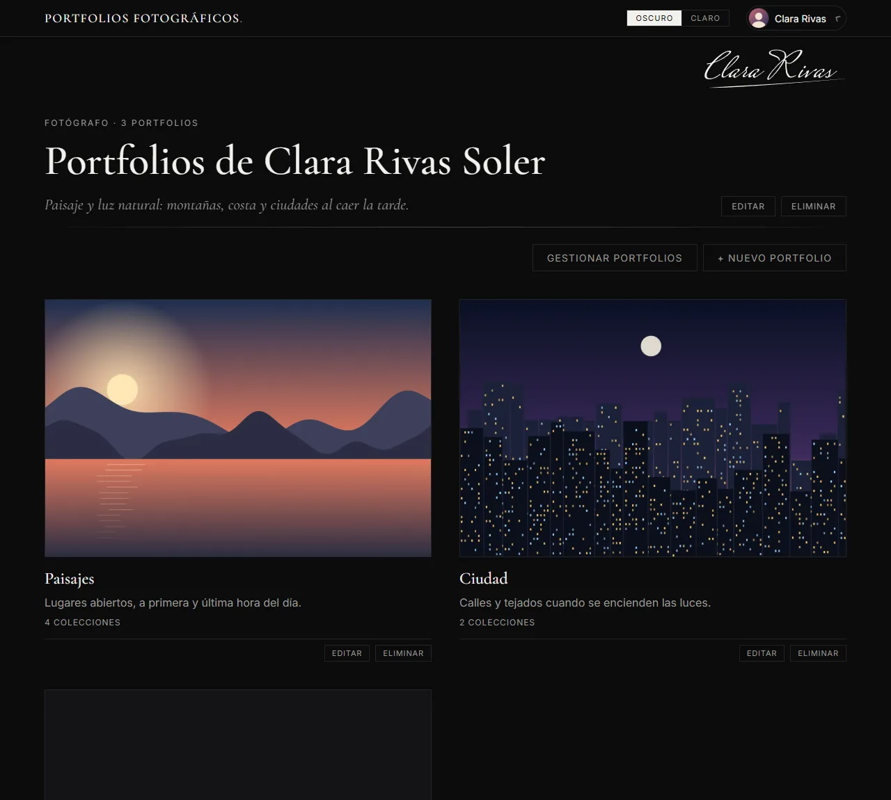

### Cómo crear un portfolio

1. En la página del fotógrafo, pulsa "+ Nuevo portfolio".
2. Escribe el "Nombre" (obligatorio; será también su dirección en la web) y, si quieres, una "Descripción".
3. Pulsa "Crear portfolio". El portfolio se añade al final de los del fotógrafo y la aplicación abre su página.

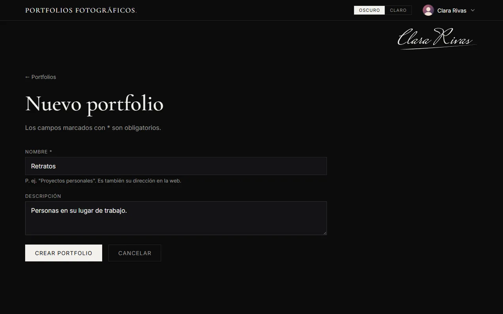

Se rechaza, con el aviso "No se ha podido crear el portfolio", si el fotógrafo ya tiene otro portfolio con el mismo nombre. Cuentan como el mismo nombre los que solo se diferencian en mayúsculas, tildes, espacios o guiones ("Ciudad de noche" y "ciudad-de noche"). También se rechazan los nombres que contienen "/" o "\\" o que empiezan por un punto.

### Cómo editar un portfolio

1. Pulsa "Editar" en la tarjeta del portfolio (página del fotógrafo) o en la cabecera de la página del portfolio.
2. Cambia el "Nombre" o la "Descripción". Si cambias el nombre, cambia también su dirección.
3. Pulsa "Guardar cambios". "Cancelar" vuelve sin guardar.

### Cómo eliminar un portfolio

1. Pulsa "Eliminar" en la tarjeta del portfolio o en la cabecera de su página.
2. Si no tiene colecciones, se elimina sin más.
3. Si tiene colecciones, aparece el diálogo "Eliminar portfolio": "Este portfolio contiene colecciones. Si lo elimina, se perderán de forma permanente sus colecciones y fotos. ¿Desea continuar?". Pulsa "Sí, eliminar" o "Cancelar".

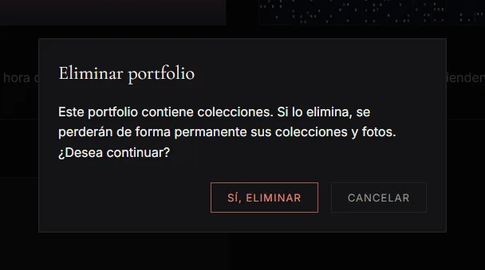

### Cómo ordenar los portfolios

1. En la página del fotógrafo, pulsa "Gestionar portfolios".
2. Verás los portfolios numerados en su orden actual. Arrastra cada uno al lugar que quieres que ocupe: los demás se desplazan mientras arrastras.
3. Suelta el portfolio. El nuevo orden se guarda en ese momento y es el que verán todos en la página del fotógrafo.

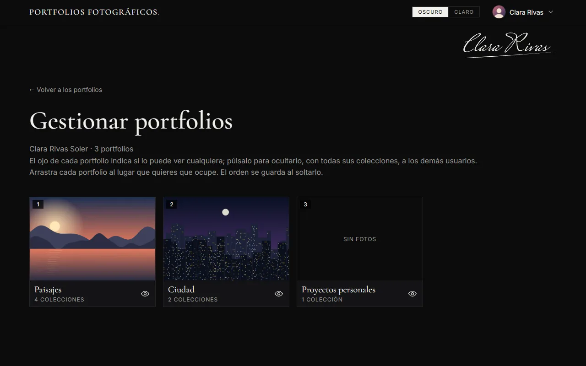

Para cancelar un arrastre, pulsa Escape antes de soltar: todo vuelve a su sitio. Si el orden no se puede guardar (por ejemplo, porque otra persona ha cambiado los portfolios mientras tanto), aparece "No se ha podido guardar el nuevo orden" y vuelve el orden anterior; recarga la página y repite. Ordenar arrastrando no funciona en pantallas táctiles.

### Cómo ocultar o mostrar un portfolio

1. En "Gestionar portfolios", busca el ojo a la derecha del nombre del portfolio.
2. Pulsa el ojo. Si estaba abierto (visible para cualquiera), pasa a estar tachado: el portfolio queda oculto para los demás usuarios, con todas sus colecciones. Púlsalo otra vez para volver a mostrarlo.

Un portfolio oculto lo sigues viendo tú, con la marca "Oculto" (un ojo tachado) en la esquina de su portada y en la cabecera de su página. Para los demás usuarios no existe: no aparece en la página del fotógrafo, no cuenta en los totales y su dirección responde "Portfolio no encontrado".

## Colecciones

Estas tareas solo se pueden hacer con las colecciones propias. Con la sesión iniciada, la página del portfolio muestra "Editar" y "Eliminar" en la cabecera y en cada colección, y los botones "Gestionar colecciones" y "+ Nueva colección".

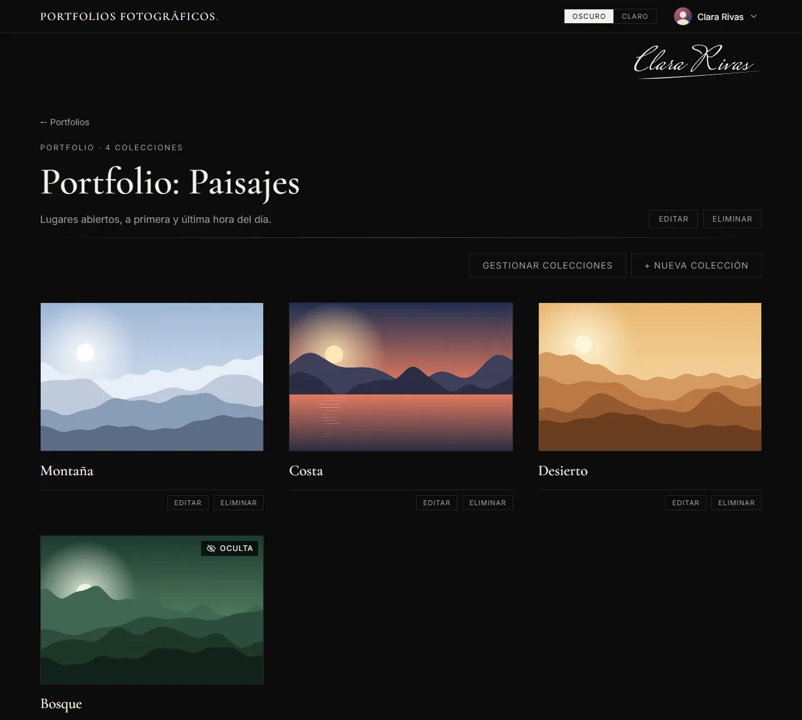

### Cómo crear una colección

1. En la página del portfolio, pulsa "+ Nueva colección".
2. Escribe el "Nombre" (obligatorio; será también su dirección en la web), y si quieres una "Descripción" y unos "Tags" separados por comas (p. ej. "paisaje, nieve").
3. Pulsa "Crear colección". La colección se añade al final de las del portfolio y la aplicación abre su página.

Se rechaza, con el aviso "No se ha podido crear la colección", si el portfolio ya tiene otra colección con el mismo nombre (con las mismas equivalencias que en los portfolios) o si un tag está repetido.

### Cómo editar una colección y sus tags

1. Pulsa "Editar" en la tarjeta de la colección (página del portfolio) o en la cabecera de la página de la colección.
2. Cambia el "Nombre", la "Descripción" o los "Tags". Para quitar todos los tags, deja el campo vacío.
3. Pulsa "Guardar cambios". "Cancelar" vuelve sin guardar.

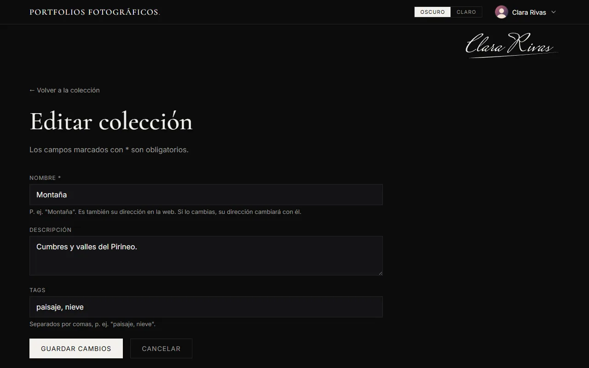

Los tags se guardan con la colección, pero hoy no se muestran en ninguna página de la aplicación.

### Cómo eliminar una colección

1. Pulsa "Eliminar" en la tarjeta de la colección o en la cabecera de su página.
2. Si no tiene fotos, se elimina sin más.
3. Si tiene fotos, aparece el diálogo "Eliminar colección": "Esta colección contiene fotos. Si lo elimina, se perderán de forma permanente sus fotos. ¿Desea continuar?". Pulsa "Sí, eliminar" o "Cancelar".

### Cómo ordenar las colecciones de un portfolio

1. En la página del portfolio, pulsa "Gestionar colecciones".
2. Arrastra cada colección al lugar que quieres que ocupe y suéltala. El orden se guarda al soltarla.

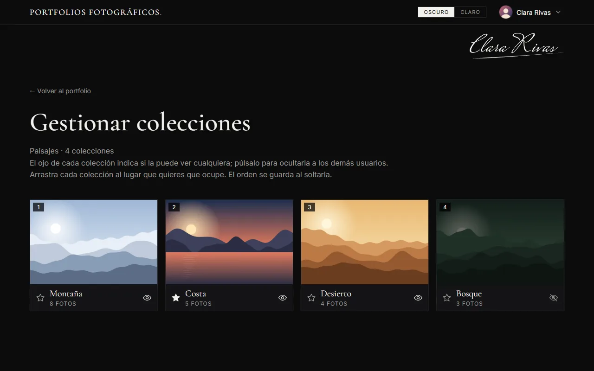

Funciona igual que ordenar portfolios: Escape cancela el arrastre y, si no se puede guardar, aparece "No se ha podido guardar el nuevo orden" y vuelve el orden anterior.

### Cómo elegir la colección que da la portada al portfolio

1. En "Gestionar colecciones", pulsa la estrella junto al nombre de la colección cuya portada quieres usar para el portfolio. La estrella queda rellena.
2. Para quitarla, vuelve a pulsar la estrella rellena.

Mientras no elijas ninguna, la portada del portfolio es la de la primera colección. Si eliminas la colección elegida, vuelve a usarse la primera.

### Cómo ocultar o mostrar una colección

1. En "Gestionar colecciones", pulsa el ojo a la derecha de la colección.
2. Tachado significa oculta para los demás usuarios; abierto, visible para cualquiera.

Una colección oculta la sigues viendo tú, con la marca "Oculta". Para los demás usuarios no aparece en el portfolio, no cuenta en los totales, su dirección responde "Colección no encontrada" y sus fotos no se pueden abrir. Si el portfolio está oculto, sus colecciones también lo están para los demás aunque su ojo esté abierto; la página lo recuerda con el texto "Este portfolio está oculto: los demás usuarios tampoco ven sus colecciones, aunque estén visibles."

## Fotos

Todas estas tareas se hacen en "Gestionar fotos", la página de mantenimiento de cada una de tus colecciones.

### Cómo entrar en "Gestionar fotos"

1. Abre la página de la colección.
2. Pulsa "Gestionar fotos", bajo la cabecera.
3. Para volver, pulsa "← Volver a la colección".

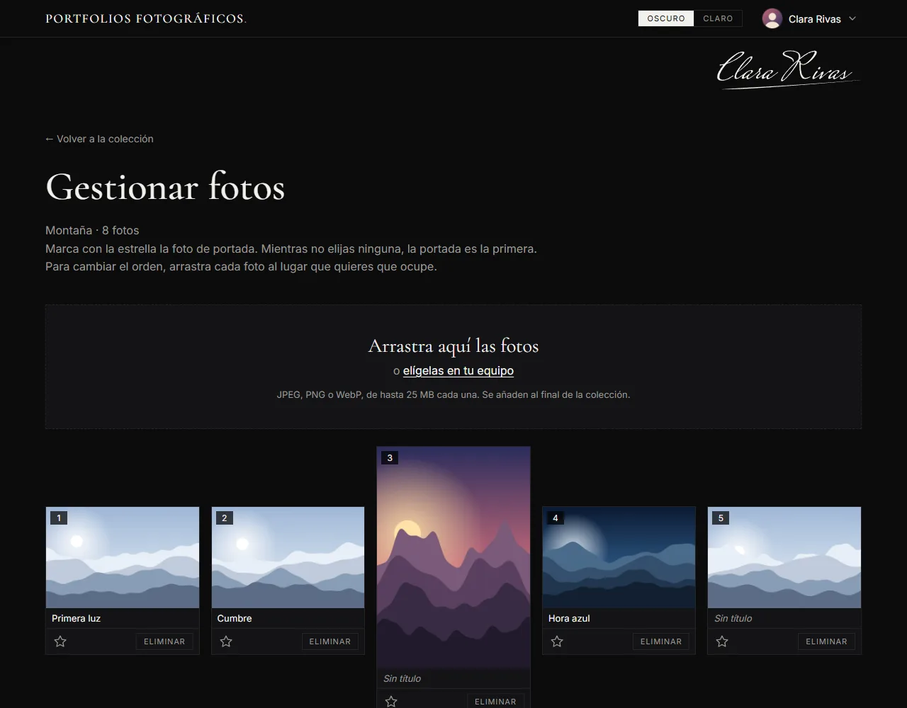

### Cómo subir fotos a una colección

1. En "Gestionar fotos", arrastra las fotos desde tu equipo hasta la zona "Arrastra aquí las fotos", o pulsa "elígelas en tu equipo" y selecciónalas. Puedes añadir varias a la vez.
2. Las fotos se suben de una en una, en el orden en que las añadiste. Mientras tanto, la lista muestra "En espera" o "Subiendo…" junto a cada una, y arriba "Subiendo N fotos…".
3. Cada foto subida aparece al final de la cuadrícula de la colección.

Se admiten imágenes JPEG, PNG o WebP de hasta 25 MB cada una. La aplicación guarda cada foto en formato AVIF, con el mismo nombre y la extensión `.avif` ("Playa.jpg" se guarda como "Playa.avif"), reducida si su lado largo pasa de 3840 píxeles y sin sus metadatos (por ejemplo, la ubicación GPS). La foto original no se conserva.

Si una foto no se puede añadir, se queda en la lista con el motivo, por ejemplo:

- "No es una imagen JPEG, PNG o WebP." o "Ocupa más de 25 MB." (lo detecta el navegador antes de subirla).
- "Ya existe otra foto con el mismo fichero ("Playa.avif") en esta colección." Esto pasa también al subir "Playa.png" si ya existe "Playa.jpg", porque ambas se guardarían como "Playa.avif". Cambia el nombre del archivo y vuelve a subirla.
- "El fichero "…" no es una imagen JPEG, PNG o WebP de como máximo 25 MB." si el archivo está dañado o no es lo que parece.

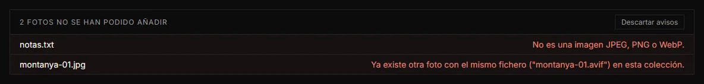

Pulsa "Descartar avisos" para limpiar de la lista las fotos que no se han podido añadir.

### Cómo poner o cambiar el título de una foto

1. En "Gestionar fotos", pulsa el cuadro de texto que hay bajo la foto (si no tiene título, muestra "Sin título").
2. Escribe el título, de 19 caracteres como máximo.
3. Pulsa Intro o sal del cuadro: el título se guarda. Escape deshace lo escrito.

Para dejar una foto sin título, vacía el cuadro (o escribe "Sin título"). El título aparece debajo de la foto en el visor.

### Cómo elegir la foto de portada de una colección

1. En "Gestionar fotos", pulsa la estrella que hay debajo de la foto, a la izquierda. La estrella queda rellena.
2. Para quitarla, vuelve a pulsar la estrella rellena.

Mientras no elijas ninguna, la portada es la primera foto. Si eliminas la foto de portada, pasa a serlo la primera.

### Cómo ordenar las fotos

1. En "Gestionar fotos", arrastra cada foto (la tarjeta entera) al lugar que quieres que ocupe. Las fotos están numeradas y la cuadrícula muestra el resultado mientras arrastras.
2. Suelta la foto. El orden se guarda en ese momento y es el de la página de la colección y el del visor.

Escape cancela el arrastre. No se puede reordenar mientras se suben o se eliminan fotos, ni mientras se escribe un título. Si el orden no se puede guardar, aparece el motivo y vuelve el orden anterior.

### Cómo eliminar una foto

1. En "Gestionar fotos", pulsa "Eliminar" debajo de la foto, a la derecha.
2. En el diálogo "Eliminar foto" ("Se eliminará esta foto de forma permanente. ¿Desea continuar?"), pulsa "Sí, eliminar" o "Cancelar".

## Cuando algo se rechaza

La aplicación no permite ciertas cosas (dos portfolios con el mismo nombre, un correo ya usado, una foto repetida…). Cuando ocurre, nada se guarda y se avisa así:

- **En los formularios** (registro, datos del fotógrafo, portfolio y colección), arriba del formulario aparece un aviso con un título ("No se ha podido crear el portfolio", "No se han podido guardar los cambios"…), lo que se intentaba hacer ("Se intentaba: …") y el motivo ("Motivo: …"). La página se desplaza sola hasta el aviso. Corrige el dato y vuelve a pulsar el botón.
- **En el navegador, antes de enviar**, los campos mal rellenados muestran su error debajo ("Indica un nombre informal.", "El correo no tiene un formato válido.", "La contraseña debe tener al menos 8 caracteres.", "Las contraseñas no coinciden.").
- **En las páginas de gestión** ("Gestionar portfolios", "Gestionar colecciones", "Gestionar fotos"), aparece un aviso con el motivo ("No se ha podido guardar el nuevo orden", "No se ha podido cambiar la visibilidad", "No se ha podido cambiar la portada"…) y lo cambiado vuelve a como estaba.
- **Al eliminar algo que tiene contenido** (un fotógrafo con portfolios, un portfolio con colecciones, una colección con fotos), la aplicación no lo borra a la primera: muestra un diálogo con lo que se perdería y solo lo elimina si se pulsa "Sí, eliminar". Las fotos piden siempre confirmación.
- **Si no se puede contactar con el servidor**, aparece "No se ha podido conectar con el servidor.".

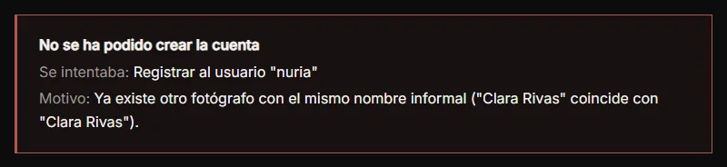
